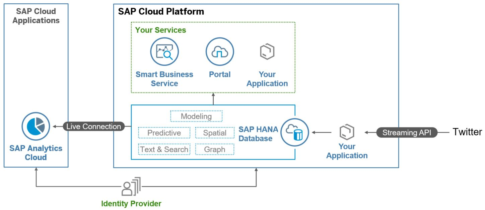
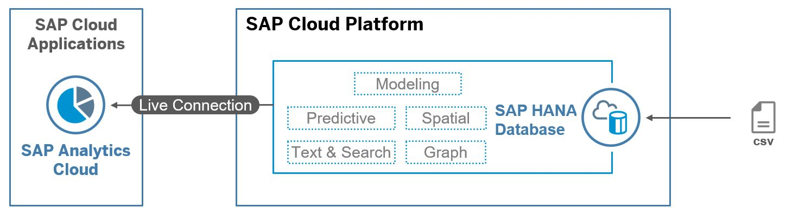

# cloud-analytics-end-to-end-sample
End-to-end analytics scenario using the trial landscapes of SAP CP and SAC.

This sample is an exercise documentation to setup your own end-to-end scenario with SAP Cloud Platform and SAP Analytics Cloud.

This Documentation is also used in the TechEd Session AIN623 - Deep Dive into SAP Analytics Cloud and SAP Cloud Platform.

**ATTENTION** If you are following the exercise outside the TechEd session AIN623, you will need a company e-mail address to create a SAC trial account, or use an existing enterprise account of SAP Analytics Cloud.

## Scenario Overview
In these exercises you will learn how to create your first end-to-end analytics scenario using SAP Cloud Platform and SAP Analytics Cloud.
Inside SAP Cloud Platform we will use SAP HANA as a database to store data and to create so called calculation views, to analyze the data.
With a live data connection, the calculation views are then consumed in SAP Analytics Cloud. The consumption happens in so call models. On top of these models a dashboard can then be build.

## Scenario Diagram

This scenario diagram shows the full end-to-end scenario. In this case Twitter is used as a data source and data is written into a SAP HANA database in SAP Cloud Platform. Therefore, you can either use for example Cloud Platform Integration or you can write your own little application and run it on SAP Cloud Platform.
Once the data is inside the SAP HANA database, the different analytical engines are used to get more insights into the data.
On top of your data you can then launch any custom SAP Cloud Platform application, to display your data, or you can use SAP Cloud Platform Portal or SAP Smart Business Service, to analyze your data further.
The dashboarding option, which is used in this scenario, is to create a live data connection to SAP Analytics Cloud and use the modeling and story creating options there.
In between SAP Analytics Cloud and SAP Cloud Platform you can additionally use an Identity Provider, to enable SSO.

In the exercises described here, some of the options above are simplified, to save time:
1. The data is not coming live from Twitter, but it is coming from a csv file, which you have to upload into your SAP HANA database.
2. We only have a look at SAP Analytics Cloud as a dashboarding option. The other services like SAP Cloud Platform Portal are not relevant for the exercises.
3. SSO is not used.

The simplified scenario diagram showing only the exercise content could look like this:

## Exercises
- [Exercise 0](./exercise0/README.md): This exercise is a prerequisite. You only need to follow these steps, if you don't have an SAP Cloud Platform trial account already.
- [Exercise 1](./exercise1/README.md): Manage roles and users. In this exercise you will learn, how to create new users in your SAP HANA database in SAP Cloud Platform and how to administer them.
- [Exercise 2](./exercise2/README.md): In this exercise you will learn how to import data with your web based development workbench.
- [Exercise 3](./exercise3/README.md): SAP HANA Modeling. In this exercise you will create your first calculation view and test it with the SQL console.
- [Exercise 4](./exercise4/README.md): Live Data Connection. In this exercise you are creating a live data connection from SAP Analytics Cloud to your SAP HANA database in SAP Cloud Platform.
- [Exercise 5](./exercise5/README.md): Modeling in SAP Analytics Cloud. How to create a model on top of your live data connection to SAP HANA will be explained in this exercise.
- [Exercise 6](./exercise6/README.md): Creating a story in SAP Analytics Cloud. In this exercise you will create your first story in SAP Analytics Cloud to get insights into your data.

## License
This project is licensed under the Apache Software License, v. 2 except as noted otherwise in the [LICENSE](./LICENSE) file.
