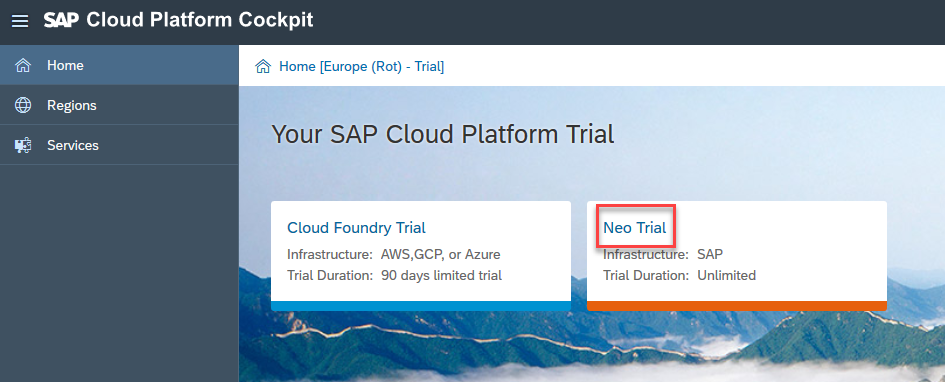
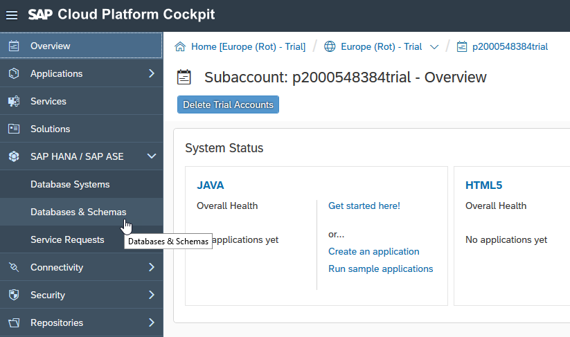
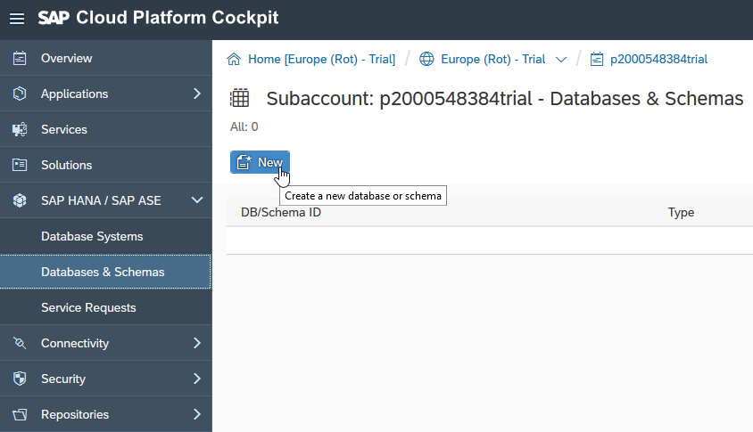
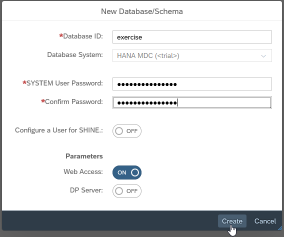
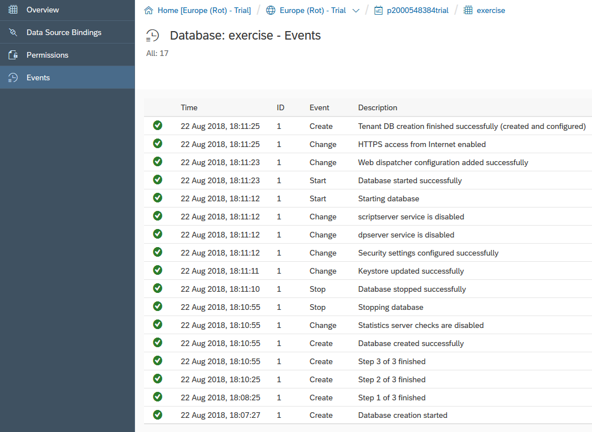

### AIN623

# Prerequisite: Setting up the Development environment

In this exercise you are creating a SAP Cloud Platform trial account and a SAP HANA database inside your new trial account.

The SAP Cloud Platform trial account is completely free of charge. In the Neo environment the trial accounts are unlimited, in the cloud foundry environment they are limited to 30 days.

The SAP HANA databases in SAP Cloud Platform trial accounts will be stopped after 1 day of inactivity. If it is stopped for a couple of days it will be deleted. You will be notified via e-mail before the database is stopped or deleted.

For more information on the SAP Cloud Platform trial accounts and their limitations, please refer to https://help.sap.com/viewer/65de2977205c403bbc107264b8eccf4b/Cloud/en-US/144e1733d0d64d58a7176e817fa6aeb3.html

## Step 1: Creating an SAP Cloud Platform Trial Account

- To create your SAP Cloud Platform Trial Account, please click this [link]( https://accounts.sap.com/ui/public/showRegisterForm?spName=https%3A%2F%2Fnwtrial.ondemand.com%2Fservices&targetUrl=&sourceUrl=). Provide all the necessary information there and click *Register*.
- A confirmation e-mail will be send to your provided e-mail address. Please confirm your e-mail address there.

## Step 2: Creating a SAP HANA database in your Trial Account

[Log on](https://accounts.sap.com/saml2/idp/sso/accounts.sap.com) to your SAP Cloud Platform trial account.

In the Cloud Platform cockpit please select *Neo Trial*.

Navigate to *SAP HANA/SAP ASE > Databases & Schemas*

Click New

Provide the Database ID `exercise` and the System User Password `Abcdef123456789`

Keep the Database System as *HANA MDC(<trial>)*

Make sure the button for *Web Access* is turned on. The “DP Server” and a user for SHINE are not needed. Therefore, make sure these buttons are turned off.

Click on *Create* to start the database creation.

The creation of your database might take a couple of minutes. Therefore, please wait until the *Events* section gives you the message “Tenant DB creation finished successfully (created and configured)”

Congratulations! You created your first SAP HANA database in your SAP Cloud Platform trial account!

Continue with [Exercise1](../exercise1/README.md)
