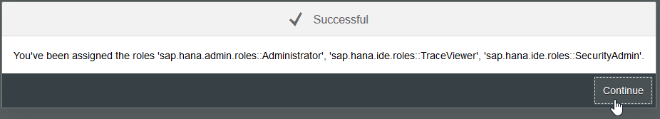
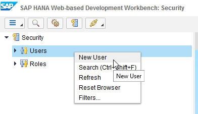
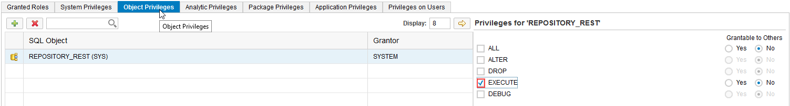

### AIN623

# Exercise 1: Manage Roles and Users

During the creation of a SAP HANA database in a SAP Cloud Platform trial account a *SYSTEM* user is created automatically. As this user is mainly designed for administrative tasks and is therefore limited in some rights, a second user is needed. How to create this user and how to assign the according roles is described in this exercise.

## Step 1: Log in to your SAP Cloud Platform Trial Account

Navigate to the [Log on](https://account.hanatrial.ondemand.com/cockpit#/home/trialhome) screen and enter your user and password. During the TechEd session AIN623 credentials will be provided to you by the speaker. Outside the TechEd session, please refer to [Exercise0](../exercise2/README.md) to create your own trial account.

In the Cloud Platform cockpit please select *Neo Trial*.

## Step 2: Navigate to the SAP HANA Cockpit

Navigate to *SAP HANA/SAP ASE > Databases & Schemas*

Navigate to the db schema *exercise*.

If your database is stopped, press *Start*

Once your database is started again, navigate to the *SAP HANA Cockpit*.

Log on with the following credentials:
- Username: `SYSTEM`
- Password: `Abcdef123456789`

The necessary roles to access the cockpit are assigned automatically to your SYSTEM user. Please click *OK* and then *Continue* in the open Pop-Ups.

In the SAP HANA Cockpit you can monitor your database in regards to memory and CPU usage as well as the general information of your database and eventual Alerts. Also, you can do the User and Role management from this cockpit.

## Step 3: Creating a new User

To create a new user please click on *Manage Roles and Users*

By clicking on the tile you are redirected to the SAP HANA Web-based Development Workbench. In the security section of this workbench you can see and manage all the different Users and Roles, which are available on your system.

Please do a right click on *Users* and select *New User*

A new mask shows up, where you can enter the necessary information to create a new user.

As a User Name please enter `DEMO` and use `Initial1` as a password. Please also use Initial1 to confirm the password. (you have to change this password, when you first logon with this user to the database)

To add additional roles, please click the green + icon.

Please search for the following roles and add them to your user with the pop-up screen:
- `MODELING`
- `sap.hana.xs.ide.roles::Developer`
- `sap.bc.ina.service.v2.userRole::INA_USER`

In the *Object Privileges* tab add the Object `REPOSITORY_REST(SYS)` with the green + button. In the *Details* section click the box next to *EXECUTE*

In the *Package Privileges* tab add the root package `.REPO_PACKAGE_ROOT` with the green + button and in the *Details* section tick the boxes next to
- REPO.READ
- REPO.EDIT_NATIVE_OBJECTS
- REPO.ACTIVATE_NATIVE_OBJECTS
- REPO.MAINTAIN_NATIVE_PACKAGES

Click the *Save* button to save your newly created user.

In the console at the bottom of your page a success message should show up. The role *PUBLIC* is granted to your new user by default.

After saving your new user successfully, please click on the *Logout* button on the top right.

## Step 4: Granting additional rights

Now login with your newly created user `DEMO` and the password `Initial1`

After clicking *Log On* you are prompted to change your password. Please enter the old password `Initial1` and a new password (for example `Welcome18`).

You are back in the User and Role management of your SAP HANA database. Please select the user *_SYS_REPO* and grant in the *Object Privileges* tab the according rights to the Schema of your newly created user, by clicking the green + button and searching for your username `DEMO`.

Also tick the box next do *SELECT* in the details section and activate the radio button to make the right grantable to others.

Click *Save* afterwards to save the changes, you made to the user.

Congratulations! You created your first SAP HANA database user!

Continue with [Exercise2](../exercise2/README.md)
