### AIN623

# Exercise 2: Importing Data

For this sample scenario a dataset with 1000 entries is provided as a csv file. As the data should be imported into a HANA table, different files are needed in the HANA database. How to create the according files and the content of these files is described in this exercise.

## Step 1: Creating the necessary Files

Navigate to the *Editor* with the small *chain* button on the top left.

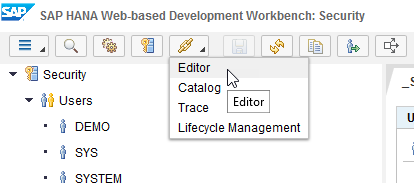

With a right click on *Content* create a new package via *New > Package*

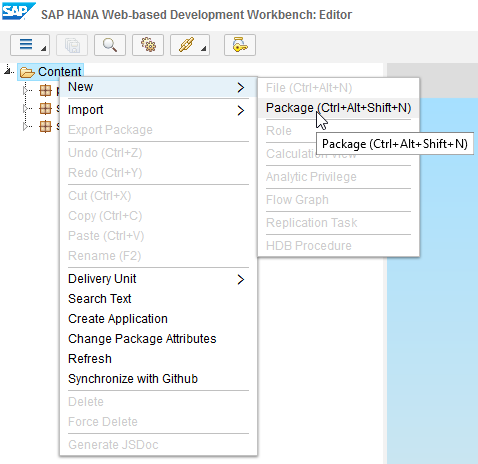

Enter `exercise` as the package name and click *Create*

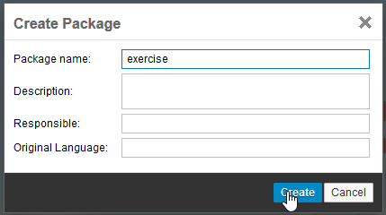

Repeat this step to create a sub-package `data` in your newly created *exercise* package. For the *data* package again create a sub-package named `loads`.

Afterwards your structure should look like this:

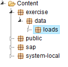

You will need three different files in the end. The content of these files is provided as text files in the GitHub repository.

As a first step create a new *.hdbdd* file in your *data* folder. Therefore, right click on your *data* folder and select *New > File*

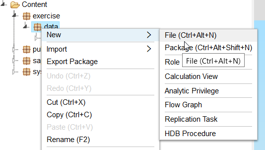

As a file name enter `tables.hdbdd` and click *Create*

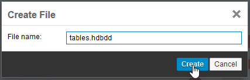

In GitHub navigate to [tables-hdbdd](./tables-hdbdd) in the *exercise2* folder.

Copy the whole content of this document with *CTRL+C*

Go back to your SAP HANA Web-based Development Workbench and paste the content of the file to your newly created file there.

Make sure the namespace and schema in the file are correct. Afterwards click *Save*. If you followed this document and named all the users and folders like described, the file should look like this:

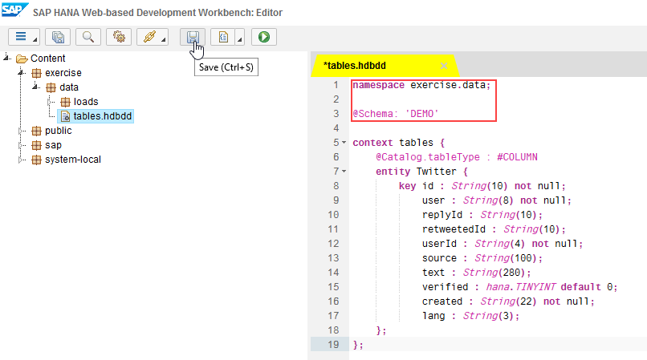

As a second step create a new file named `tweets.csv` in your *loads* folder, by clicking right and navigating through *New > File*

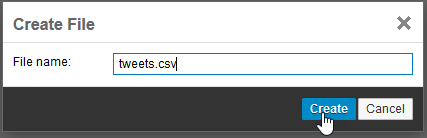

In github navigate to [tweets-csv](./tweets-csv) in the *exercise2* folder.

Again copy the whole content of this document with *CTRL+C*

Go back to your browser and paste the content from the file into the tweets.csv file with *CTRL + V*.

Click *Save*

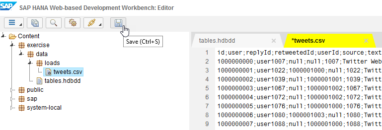

The last file, which is missing is the *.hdbti* file. Therefore, create a new file in your *data* folder by clicking right on *data* and click *New > File*.

As a filename enter `tables.hdbti` and click *Create*

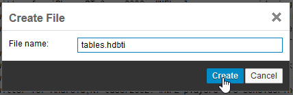

In github navigate to [tables-hdbti](./tables-hdbti) in the *exercise2* folder.

Again copy the whole content of this document with *CTRL+C*

In your web based development workbench paste the content to the newly created file.

Please make sure, the paths to your data file and the schema are correct. If the content of your file is correct, please click *Save*.

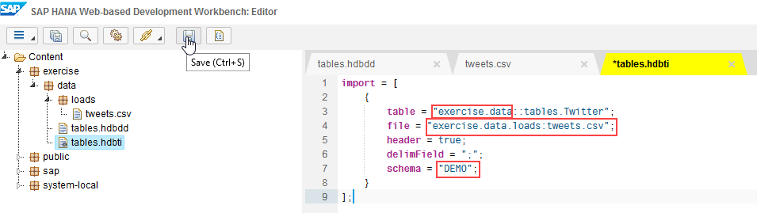

Congratulation! You uploaded the data successfully.

You can now continue with [Exercise3](../exercise3/README.md)

## Optional: Verifying data upload

To verify, the data was uploaded successfully, navigate to *Catalog* with the small *Chain* icon on the top

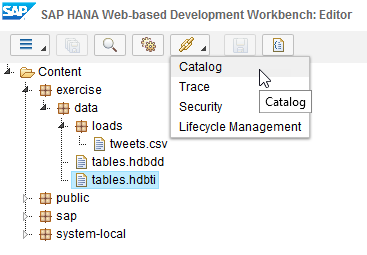

Navigate to the schema of your user, search for the automatically created table in the *Tables* folder and open it. (Catalog > DEMO > Tables > exercise.data::tables.Twitter )

Afterwards click *Open Content…*

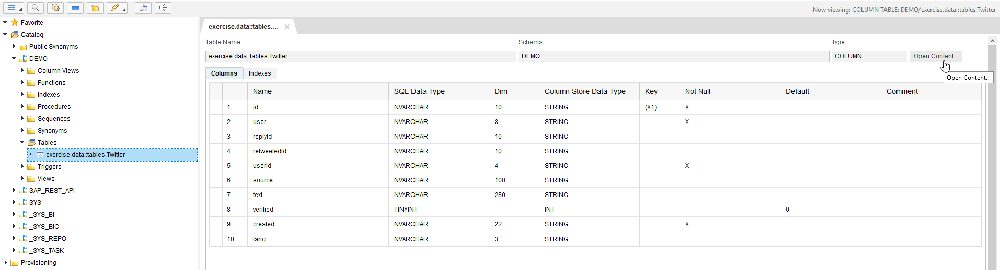

A new tab should open with the content of your table.

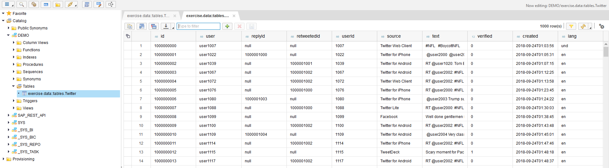

Continue with [Exercise3](../exercise3/README.md)

## Troubleshooting

If there is no content in your table, please check the content of your files, you created in exercise2. Make sure, all the paths and schema names are correct. If they are correct, open your *tweets.csv* file add a space (“ “) and delete it again. Afterwards save the file once more and do the same in the *tables.hdbti* file. After saving and activating these two files again, the content of your table should appear.

Please also make sure, you named all the packages and files exactly as stated in this exercise. Common typos are for example "load" instead of "loads" or capital letters at the beginning.
