# Exercise 3: SAP HANA Modeling

Once the data is imported correctly into the SAP HANA database, it has to be transformed, before it can be handed over to SAP Analytics Cloud. SAP Analytics Cloud expects a calculation view.

Inside a calculation view different data modeling options are possible. For more information on calculation views in SAP HANA databases please refer to https://help.sap.com/viewer/52715f71adba4aaeb480d946c742d1f6/2.0.03/en-US/18e1d60a75524e43b81acff652dae772.html

#### Notice

If you are still in the *Catalog* to view your table, go back to your *Editor* by using the *Chain* icon on the top left.

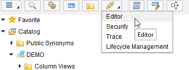

## Step 1: Creating a New Calculation View

Click right on your package *exercise* and click *New > Package*

As a package name enter `models` and click *Create*

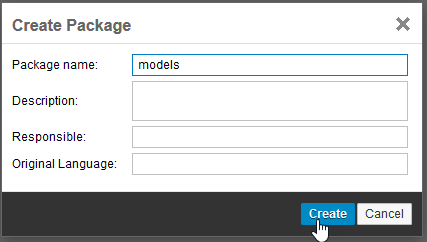

To create a new calculation view, click right on your new package *models* and click *New > Calculation View*

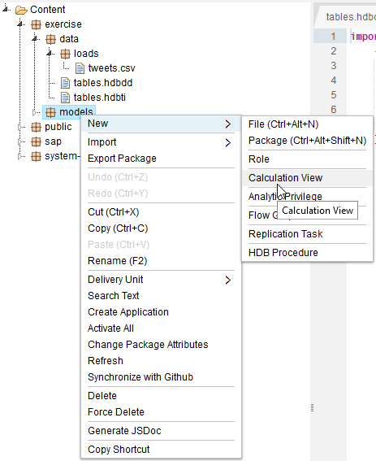

As a name enter `SIMPLEVIEW`

Leave the radio button on *Graphical* to use the graphical modeler to create your calculation view.

The data category is *CUBE*

After entering the information click *Create*

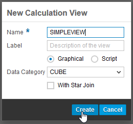

The graphical modeler shows up, where you can start to create your calculation view.

As a first step add a *Projection* to the calculation view, by clicking the button and dropping the icon to the modeling pane.

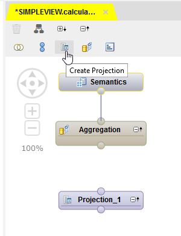

To add a data source to the projection, click the green + button next to the projection.

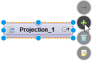

Search for `Twitter` and select the table you created during the exercises as a datasource.

Click *Ok*

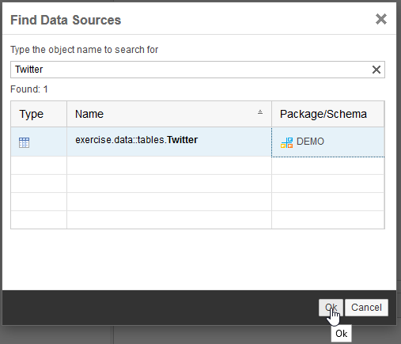

In the *Data Sources* column the columns of your table should appear.

Drag and drop the top node to the *Output Columns* on the right

All columns should now be mapped to the output column.

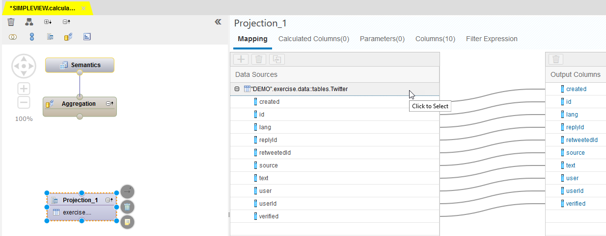

## Step 2: Creating Calculated Columns

Click on *Calculated Columns*

Click +

As a name enter `LOCALTIMESTAMP`

As a Data Type select *TIMESTAMP*

Instead of Column Engine **select SQL** and enter the following expression:

`UTCTOLOCAL("created", 'UTC+2')`

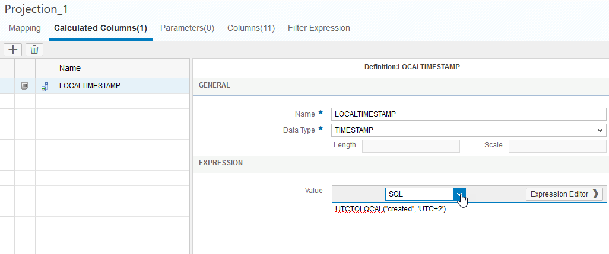

Click + to create a new calculated column

As a name enter `HOUR`

Select *NVARCHAR* as data type and enter  `length 5`

Change from Column Engine to **SQL** and enter the following statement:

`right('0' || hour("LOCALTIMESTAMP"), 2) || ':00'`

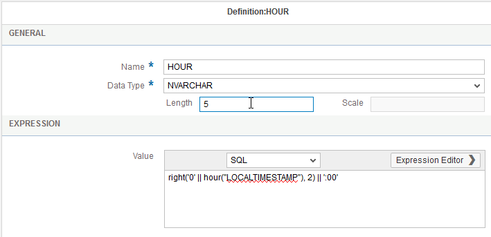

Click + to create a third calculated column

As a name enter `CREATIONDATE`

Select *NVARCHAR* as data type and enter `length 10`

Change to **SQL** and enter the following statement:

`to_varchar(to_date(LOCALTIMESTAMP),'YYYY-MM-DD')`

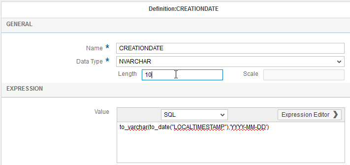

Click + to create another calculated column

As a name enter `ISOWEEK`

Select *NVARCHAR* as data type with `length 10`

Change to **SQL** and enter the following expression:

`ISOWEEK(LOCALTIMESTAMP)`

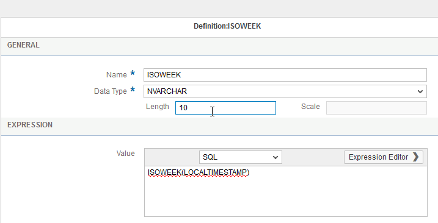

Click + to create an additional calculated column.

As a name enter `HOURDISPLAY`

Select *NVARCHAR* as data type with `length 16`

This time **leave the value for Column Engine** and enter the expression:

`string("CREATIONDATE" + ' ' + "HOUR")`

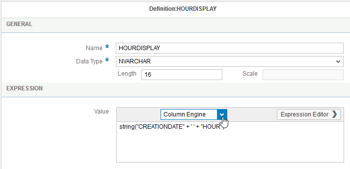

Click + to add the last calculated column.

As a name enter `VERIFIEDUSERID`

Select *VARCHAR* as data type with length 1

Enter the following expression in the **Column Engine**:

`if("verified"=1, "user", string(null))`

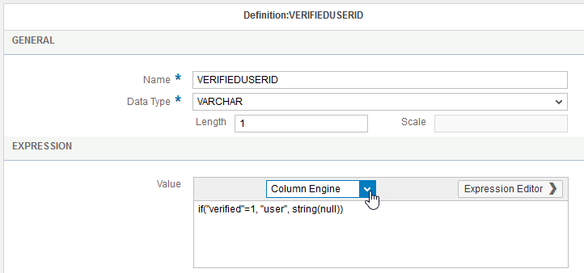

Click the arrow button next to the projection and drag and drop it to the small bubble on the bottom of the aggregation box

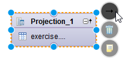

In the mapping of the aggregation drag and drop the following values from the Data Source to the Output Columns:
- id
- lang
- replyId
- retweetedId
- source
- user
- userId
- LOCALTIMESTAMP
- HOUR
- CREATIONDATE
- ISOWEEK
- HOURDISPLAY
- VERIFIEDUSERID

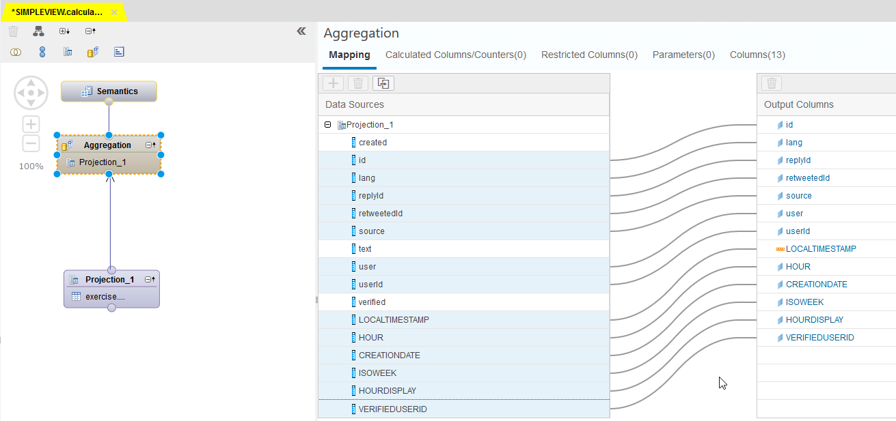

Switch to the *Calculated Columns/Counters* tab

Click *+ > Counter*

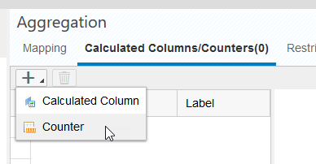

As a name enter `NOOFENTRIES`

As a label enter `No. of Entries`

Click the + in the counter section and select *id* via the small squares on the right of the cell.

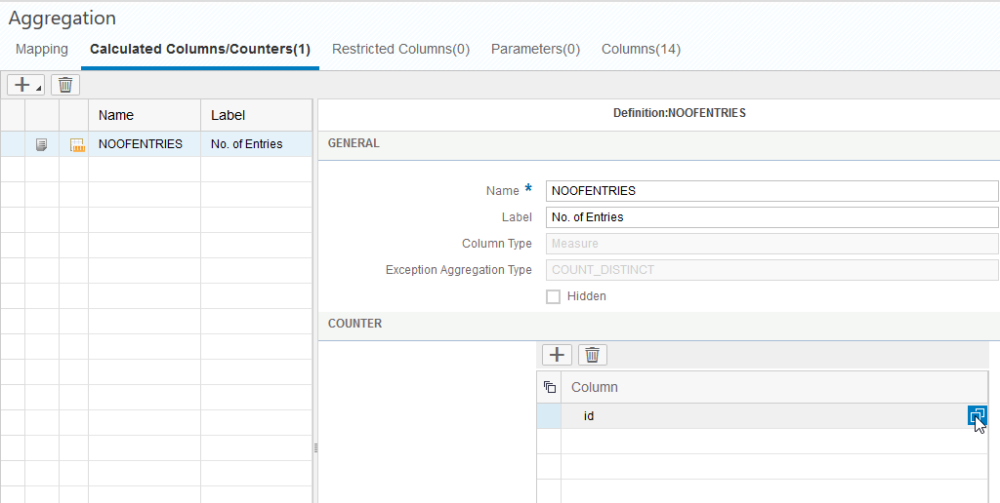

Click *+ > Counter* to create a new counter

As a name enter `NOOFVERIFIEDUSERS`

As a label enter `No. of Verified Users`

For the counter select `VERIFIEDUSERID` as a column

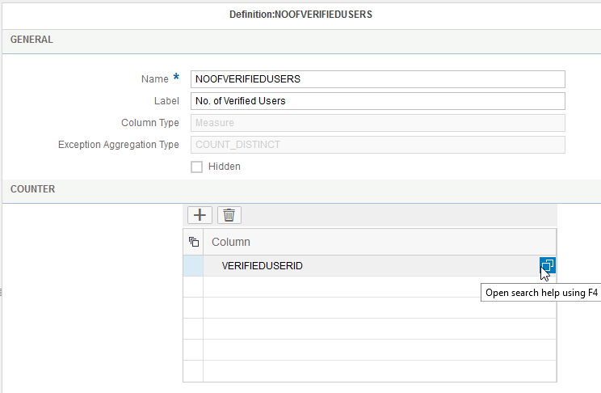

## Step 3: Adding a Hierarchy and saving your Calculation View

Click on the *Semantics* node

In the columns tab you should see all 15 columns listed

Change the type of *LOCALTIMESTAMP* from Measure to Attribute if necessary.

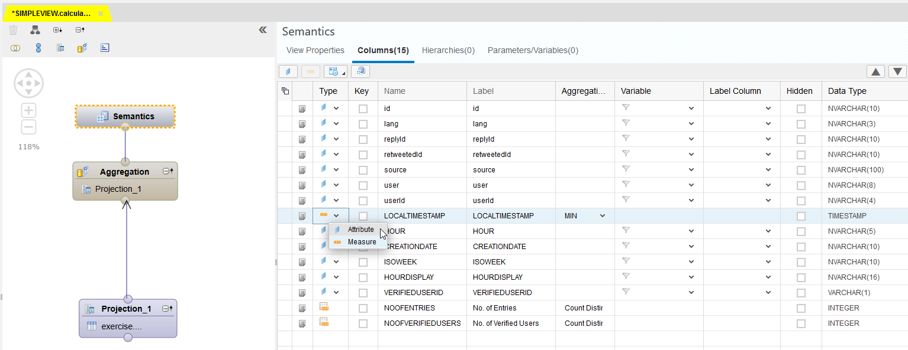

Switch to the *Hierarchies* tab

Click *+ > level hierarchy*

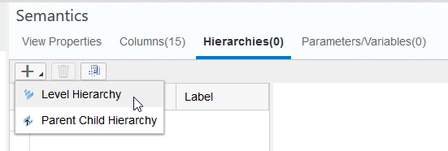

As a name enter `TIME_HIERARCHY`

As a label enter `Time Hierarchy (Drill-Down)`

Under *nodes* click + and add three levels

Select *ISOWEEK* as the first level

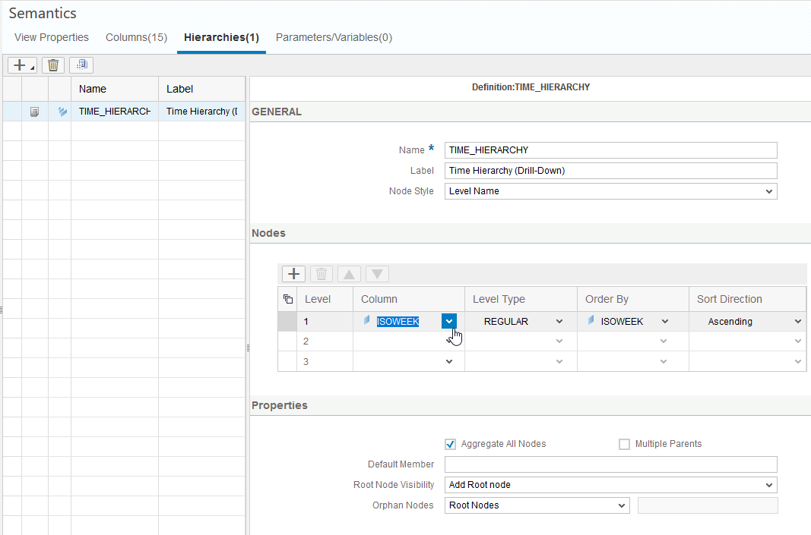

Select *CREATIONDATE* as second level

And select *HOURDISPLAY* as third level

After finishing all the steps click *Save*

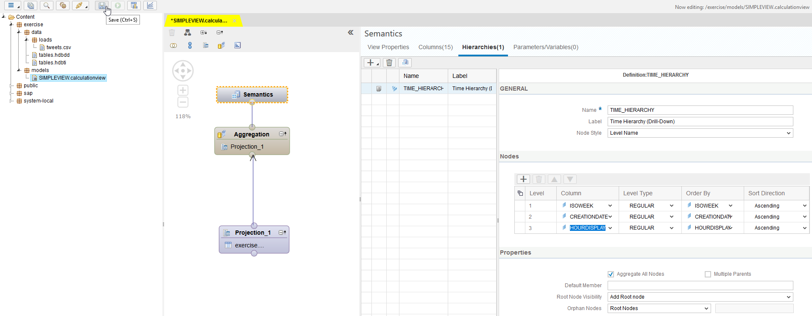

Congratulation! You you created your firs calculation view.

You can now continue with [Exercise4](../exercise4/README.md)

## Optional: Checking for the Calculation View in the Catalog

If you want to check, whether your calculation view was saved successfully in the SAP HANA database you can go to the *Catalog* view with the small *Chain* icon

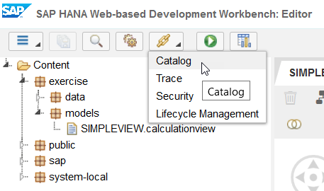

Go to *Catalog > _SYS_BIC > Column Views*

In this folder all the calculation views of your SAP HANA database are listed. This should also include your newly created calculation view. Open it with a double click.

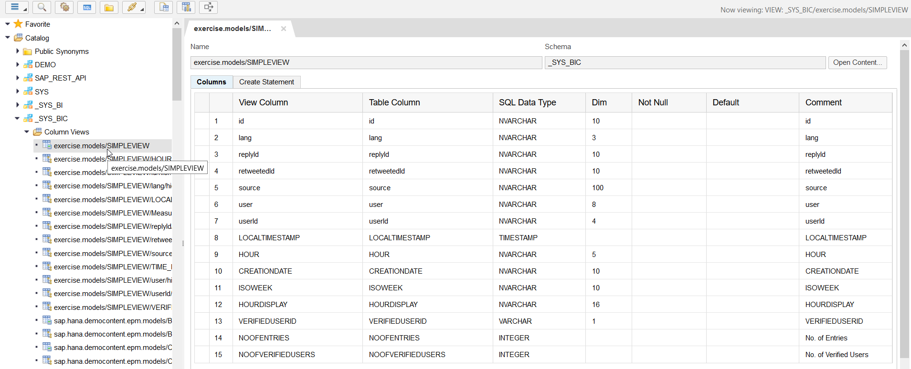

To test the calculation view you can now open a SQL console with the according button and write the following statement:
`SELECT * FROM <drag and drop your calculation view here>`

Afterwards, click *Execute* and the content should be displayed at the bottom of your screen.

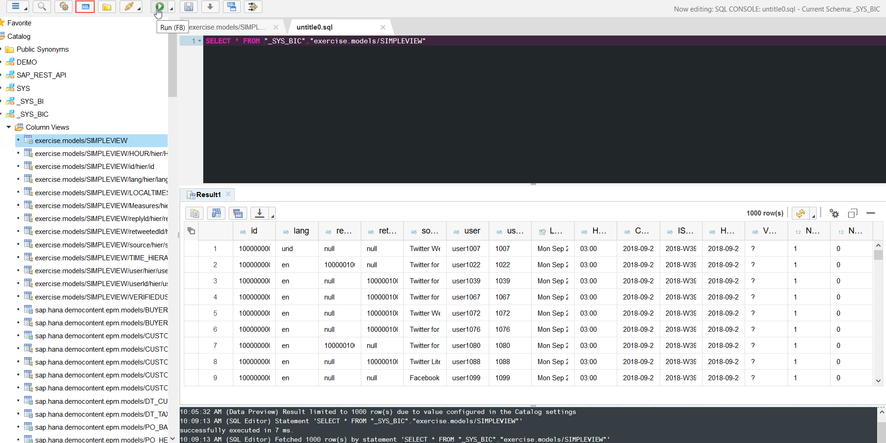

To test your calculated columns, you can exchange the `*` in your select-statement by *NOOFENTRIES*

Click *Execute* again

The result should show 1000 (as the provided dataset consists of 1000 rows)

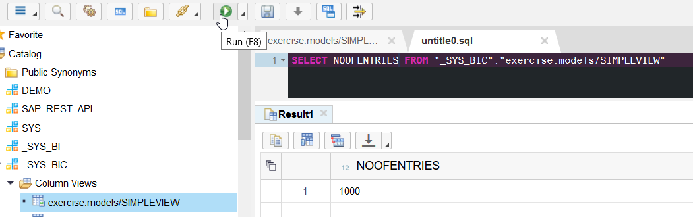

Congratulations! You created your first calculation view and tested it successfully.

Continue with [Exercise4](../exercise4/README.md)
