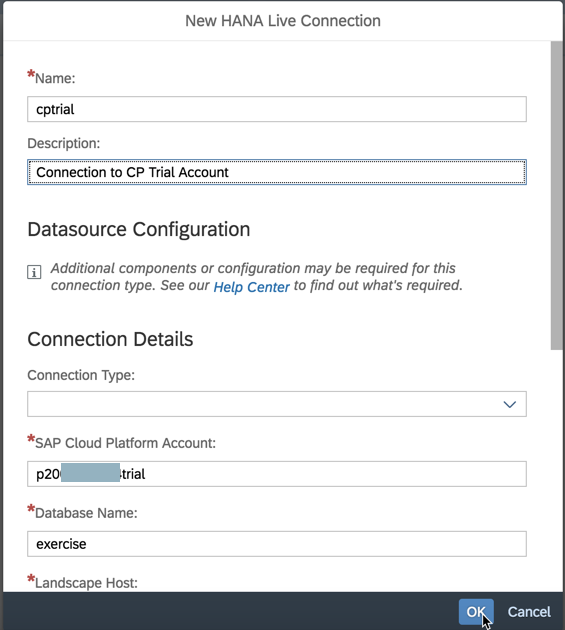

### AIN623

# Setting Up A Live Data Connection to SAP Analytics Cloud

You can create live data connections to on-premise and cloud systems. Data is “live”, meaning that when a user opens a story in SAP Analytics Cloud, changes made to the data in the source system are reflected immediately.

In SAP Analytics Cloud, you can create models from data sources in on-premise or cloud systems, build stories based on those models, and perform online analysis without data replication. This feature allows SAP Analytics Cloud to be used in scenarios where data cannot be moved into the cloud for security or privacy reasons, or your data already exists on a different cloud system.

In this exercise you are going to create a live data connection to an SAP Cloud Platform (SAPCP) system and give an SAP HANA user permission to use the connection in SAP Analytics Cloud.

## Step 1: Creating an Trial Account for SAP Analytics Cloud

*Note: if you already have an enterprise account of SAP Analytics Cloud, you can use this account, too, to do the following exercises. In this case you can skip Step 1.*

**For the following exercise you will need a company e-mail address.**
If you are attending the TechEd session AIN623 and don’t have a company mail address or if you are an SAP employee, please contact your course instructor on how to proceed.

Go to the [SAP Analytics Cloud website](https://www.sapanalytics.cloud/)

Click the button *Try it free* or *Start your free 30-day trial*

Enter your company e-mail address and press *Submit*

After submitting your e-mail address, you will receive an e-mail. Please follow the instructions in the e-mail to verify your account.

The e-mail also includes the link to your trial tenant. Please keep the e-mail or save the link, so you can log in to your trial tenant also later.

Congratulation! You registered for an SAP Analytics Cloud trial account and you can now start and try out the different features of SAP Analytics Cloud 30 days for free.

## Step 2: Creating a Live Data Connection

*Before you start with this chapter, please make sure your SAP HANA database in your SAP Cloud Platform trial account still says “STARTED” in the overview screen. If not, press Start.*

Navigate to the overview screen of your SAP Cloud Platform trial account. At the bottom of the page you can find the subaccount information. There you can see the display name of your trial account, as well as the (technical) name.

Please copy the technical name of your subaccount either with a right mouse click or with *CTRL + C*.

Navigate back to your SAP Analytics Cloud trial account or log in to it again in a second browser tab (the link to your trial tenant was provided to you with the activation e-mail or by your course instructor).

Click on the *Main Menu* button in the top left corner of your page and then click *Connection*

In this screen you can see later all the different connections, you created.

To create a new connection to SAP Cloud Platform, SAP HANA service, please click
*+ > Live Data Connection > SAP HANA*

In the upcoming Pop-Up you can enter all the necessary information to create the live data connection to your SAP Cloud Platform, SAP HANA service

*Note: if you are using the SAP Analytics Cloud trial account, you can only connect to the trial accounts of SAP Cloud Platform. Not to a dedicated enterprise account.*

Enter the following information in the screen:
- Name: *cptrial*
- Description: *Connection to CP Trial Account*
- Connection Type: *SAP Cloud Platform*
- SAP Cloud Platform Account: *CP account name* (the technical name of your subaccount, you copied in an earlier step)
- Database name: *exercise* (the name of your SAP HANA database in SAP Cloud Platform)
- Landscape Host: Europe (Rot) – **Trial**
- User Name: *DEMO* (this is the user of your SAP HANA database)
- Password: *Welcome18*
- Tick the box to save the credentials

Press *Ok*

After clicking *Ok* the connection is created automatically and appears in your connection overview

Congratulations! You created your first live data connection in SAP Analytics Cloud.

Continue with [Exercise5](../exercise5/README.md)

## Troubleshooting

If the creation of your connection fails, please check:
- Did you select *Europe (Rot)* instead of *Europe (Rot) – Trial*?
- Is your database in SAP Cloud Platform still running? If not – please press the *Start* button
- Please check your SAP HANA database user: the user must be assigned the sap.bc.ina.service.v2.userRole::INA_USER role and SELECT privileges on all view items in the *_SYS_BIC* schema, the user needs to access (see also: https://help.sap.com/doc/00f68c2e08b941f081002fd3691d86a7/release/en-US/f733b47974674d2da65cef3db90ec088.html)
