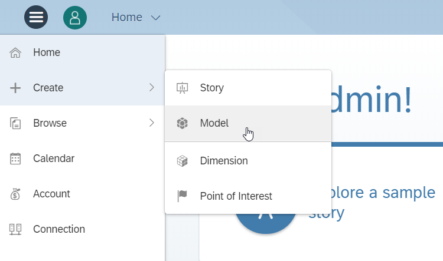
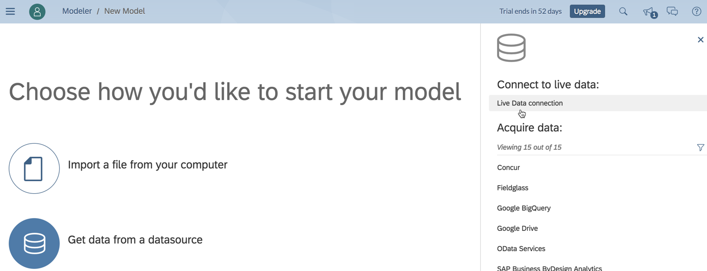
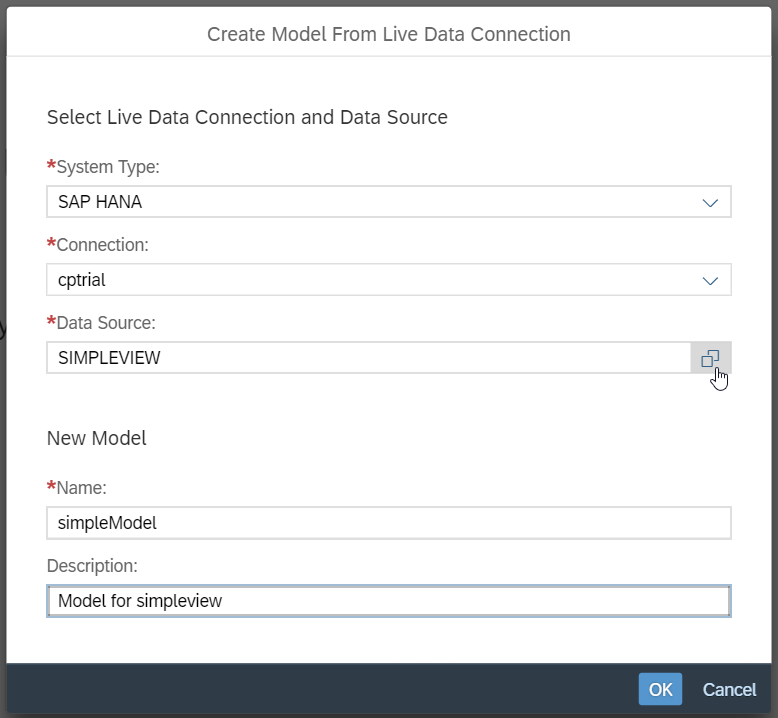
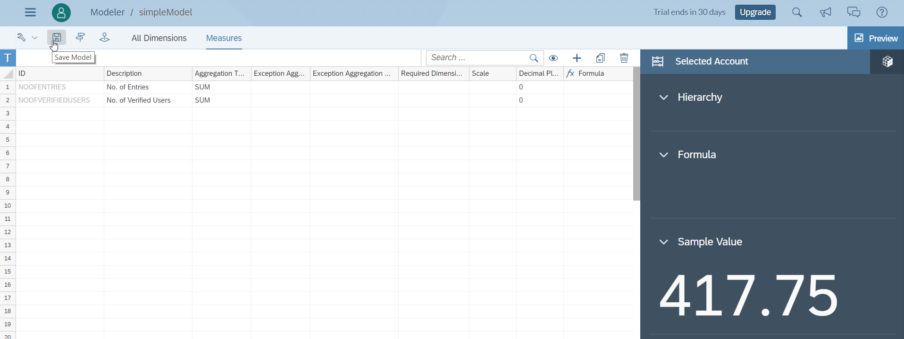

### AIN623

# Modeling in SAP Analytics Cloud

## Step 1: Creating a Model on a SAP HANA Live Data Connection

Go to the home screen of your SAP Analytics Cloud trial account

Via the main menu navigate to *Create > Model*

To start your model choose *Use a datasource > Live Data connection*

A pop-up shows up where you need to enter the following information:
- System Type: *SAP HANA* (use the dropdown menu)
- Connection: *cptrial* (use the dropdown menu)
- Data Source: *SIMPLEVIEW* (you can also select it with the help button on the right site)
- Name: *simpleModel*

A new screen shows up, where you can see the measures of your calculation view and a preview of the model on the right-hand side.

*Optional: If you are interested, you can also click on All Dimensions to view the dimensions of your calculation view.*

After exploring your model, click *Save Model*

A success message should show up on the bottom of your screen.

Congratulations! You created your first model successfully. You can now go back to the home screen of your SAP Analytics Account.

Continue with [Exercise6](../exercise6/README.md)
