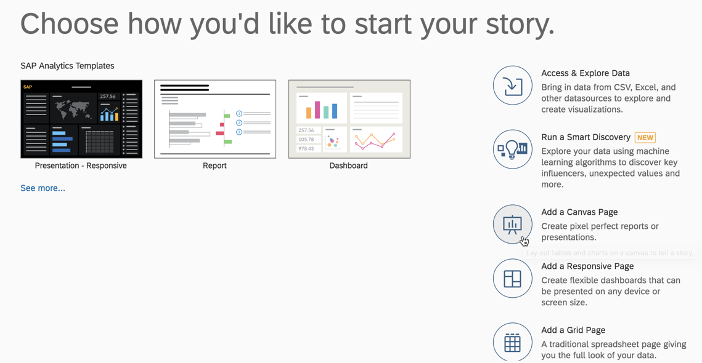

### AIN623

# Exercise 6: Creating a Dashboard in SAP Analytics Cloud

A story is a presentation-style document that uses charts, visualizations, text, images, and pictograms to describe data. Once you create or open a story, you can add and edit pages, sections, and elements as you like. The story toolbar is divided into different categories such as File, Insert, Data, and Tools to help you find options and perform tasks more efficiently.

For more information on stories in SAP Analytics Cloud, please have a look at the help documentation: https://help.sap.com/doc/00f68c2e08b941f081002fd3691d86a7/release/en-US/29e0feaf17584e118ef30e6102008224.html

## Step 1: Creating a new dashboard in SAP Analytics Cloud

Via the main menu of your SAP Analytics Cloud account navigate to *Create > Story*

To start with your story, click *Add a Canvas* (If you are interested in creating a mobile compatible story, you can also choose “Add a Responsive Page”. But these exercises will be based on the Canvas page.)

## Step 2: Adding Charts to your story

Click *Chart* to add it as the first item to your story.

From the upcoming dropdown select your *simpleModel* as a datasource and click *Ok*

With the Builder tool on the right-hand side of your screen you can now choose your chart type and add the measures and dimensions, as well as modifying the colors of your chart.

Leave the chart type as *Bar/Column*

From the dropdown choose *No. of Entries* as a measure

As a dimension add *Time Hierarchy* from the dropdown

Adding a hierarchy as a dimension to your chart allows you to drill down and get more insights into your data.

As a first level, all data is shown in one bar. To test the drill down functionality, select the bar in the chart and press the *arrow down* button.

As a second drill down step the data is split into two different calendar weeks.

Either drill out again with the *arrow up*, or to go further down, selecting the bottom bar and clicking again the *arrow down* button. This splits the data of this calendar week again down into the different days. You can drill down further until you reach the hourly view. Or you can use the *arrow up* button to go one step up in your hierarchy again.

To add a second chart to your story, click the *Chart* button on the top of your screen.

In the upcoming builder view select *More > Donut*

As a measure select again *No. of Entries*.

Select *lang* as a dimension to have a look at the different languages, which are used in the tweets of your dataset.

## Step 3: Using the Styling and Color options

If you don’t like the colors of the chart you can use the dropdown menu to change the color palette or create a new color palette according to your needs.

To make the chart a bit more consumable you can also limit the number of dimensions to the top 5 or top N options by using the small trophy icon next to the chart.

With the styling options in your builder you can additionally change various other characteristics, like background color of your chart or the font formatting.

To access it click on the brush next to your builder.

To show or hide the legend or titles in one of your charts go to *…> Show/Hide* next to your chart.

To arrange the charts, you can use the drag and drop functionality and also resize them easily via drag and drop.

Feel free to test all the functionalities, given by SAP Analytics Cloud to change the size and color and formatting of your charts.

The model also contains a lot more measures and dimensions, than the ones used for these two charts so feel free to use all of them to add additional charts to your story and to build a bigger dashboard to get more insights into your dataset.

## Step 4: Saving your Story

Once you are done with all the changes you can save your story. Therefore, use the save icon on the top ribbon. Choosing *Save As File* would generate a pdf export of your story. Choosing *Save As Template* would save your story as a template which can later be reused to generate a new story more easily with predefined colors and already arranged charts.

Choose *Save* to save your story in SAP Analytics Cloud.

You can add a title to your story, for example `MyFirstStory`

Per default your story is saved in your own folder. You can also decide to save it in the *Public* folder to make it accessible for other users on your tenant (only relevant for enterprise accounts). Or you can create your own folder structure.

After entering your story title click *Ok*

Congratulations! You created your first own story in SAP Analytics Cloud!

**Congratulations! You finished all the exercises successfully!**
